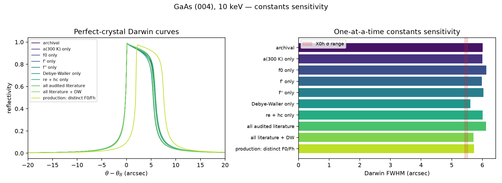

# Tier-3 constants sensitivity — GaAs (004), 10 keV

This follows the [Tier-2 provenance audit](CONSTANTS_PROVENANCE.md): change one
constant group at a time, measure its effect on the internal perfect-crystal
and uniform-strain checks, and compare the perfect-crystal result to an
independent external calculator.

Run:

```bash
python scripts/benchmark_constants_sensitivity.py
```

Outputs:

- `docs/constants_sensitivity.json` — machine-readable values
- `docs/images/constants_sensitivity.png` — curves and FWHM comparison



## Independent external reference

Sergey Stepanov's [X0h / X-Ray Server](https://x-server.gmca.aps.anl.gov/x0h.html)
was queried on 2026-07-18 for:

- GaAs, (004), 10.000 keV
- symmetric Bragg geometry, σ polarization
- room-temperature database structure (`a = 5.6532 Å`)
- all available dispersion databases (X0h/International Tables, Henke,
  Brennan–Cowan, Windt, Chantler)

X0h results:

- Bragg angle: **26.017°**
- σ Darwin FWHM: **5.4238–5.5212 arcsec**
- \(|\operatorname{Re}\chi_h| = 1.0360\times10^{-5}\)** (X0h database)
- off-Bragg absorption depth: **49.14 μm** (X0h database)
- Bragg extinction length: **1.670 μm**

The corresponding absorbing semi-infinite perfect-crystal curve downloaded
from X0h/GID_sl has **FWHM 5.73686 arcsec** and peak reflectivity **0.97283**.
The narrower tabulated "Darwin FWHM" is the susceptibility-based intrinsic
width; the absorbing curve FWHM is the like-for-like numerical target.

This is an external calculation, not a value generated by this repository.
X0h is also reference 58 in Jo et al., Sci. Rep. **12**, 16606 (2022).

## One-at-a-time results

| Constants case | Numerical FWHM (″) | Δ width vs archival | Peak R | Δ peak | ε=0.002 layer shift (″) |
|---|---:|---:|---:|---:|---:|
| archival notebook | 6.010 | — | 0.98834 | — | −196.59 |
| \(a(300\,K)\) only | 6.002 | −0.13% | 0.98833 | −0.00% | −196.50 |
| Waasmaier–Kirfel \(f_0(Q_h)\) only | 6.130 | +2.00% | 0.98869 | +0.04% | −196.59 |
| Henke \(f'\) only | 5.982 | −0.46% | 0.98826 | −0.01% | −196.59 |
| Henke \(f''\) only | 6.035 | +0.41% | 0.99032 | +0.20% | −196.59 |
| 300 K Debye–Waller only | 5.612 | **−6.62%** | 0.98792 | −0.04% | −196.59 |
| CODATA \(r_e+hc\) only | 6.010 | −0.00% | 0.98834 | −0.00% | −196.59 |
| all audited constants, no DW | 6.119 | +1.81% | 0.99055 | +0.22% | −196.50 |
| all audited constants + DW, but \(F_0=F_h\) | 5.714 | −4.92% | 0.99021 | +0.19% | −196.50 |
| **production: distinct \(F_0,F_h\)** | **5.732** | −4.63% | **0.97389** | −1.46% | −196.94 |

Room-temperature harmonic Debye–Waller factors are
\(B_\mathrm{Ga}=0.622\) and \(B_\mathrm{As}=0.483\) Ų from Stevenson,
*Acta Cryst.* **A50**, 621–632 (1994).

## What explained the external difference?

The archival numerical width (6.010″) is 4.8% broader than the like-for-like
X0h/GID_sl absorbing curve, and its peak reflectivity is 1.6% high.
Replacing \(a,f_0,f',f''\) alone does not close the gap.

The dominant missing physical constant is the **300 K Debye–Waller factor**:

- Debye–Waller alone narrows the code curve by 6.85%.
- All audited constants + Debye–Waller narrow the diffracting susceptibility.
- The standard nonabsorbing two-beam formula
  \[
  \Delta\theta_D =
  \frac{2|\chi_h|}{\sin(2\theta_B)},\qquad
  |\chi_h|=\frac{r_e\lambda^2|F_h|}{\pi V_c}
  \]
  gives **5.404″** with all audited constants + Debye–Waller: within
  **0.4–2.1%** of the X0h range.

The decisive formula error was the notebook approximation **\(F_0=F_h\)**.
The forward susceptibility must use \(f_0(Q=0)=Z\), while the diffracting
susceptibility uses \(f_0(Q_h)\) and Debye–Waller attenuation. With distinct
\(F_0,F_h\), the production solver gives:

- FWHM **5.732″** vs X0h/GID_sl **5.73686″** (−0.09%);
- peak reflectivity **0.97389** vs X0h/GID_sl **0.97283** (+0.11%);
- \(\chi_0,\chi_h\) real parts within 1% of X0h.

This closes the external perfect-crystal benchmark to numerical sampling and
table-database precision.

## Other robustness findings

- **Peak reflectivity depends strongly on using the correct forward
  susceptibility:** table changes alone move it little, but distinct
  \(F_0,F_h\) brings it into 0.11% agreement with X0h/GID_sl.
- **Strain-to-angle conversion is exceptionally robust:** the ε=0.002 layer
  shift changes by only 0.09″ (<0.05%) across all cases. The internal
  \(\Delta\theta=-\varepsilon\tan\theta_B\) validation is not sensitive to
  these constants.
- **Absolute Bragg angle is not robust to rounded \(a\):** modern \(a(300 K)\)
  remains required for predictions on an absolute θ axis. Relative
  \(\theta-\theta_B\) plots are unaffected.

## Recommendation

1. **Use the externally benchmarked modern calculator as the production
   default.** It includes modern \(a,f_0,f',f''\), species-specific 300 K
   Debye–Waller factors, and distinct \(F_0,F_h\).
2. **Keep the notebook calculator only as `gaas_004_10kev_legacy`** for
   provenance and exact frozen-regression tests.
3. For paper Fig. 3 validation, continue to report
   \(\theta-\theta_B\); the current strain-induced asymmetry and peak-shift
   conclusions are unchanged.

