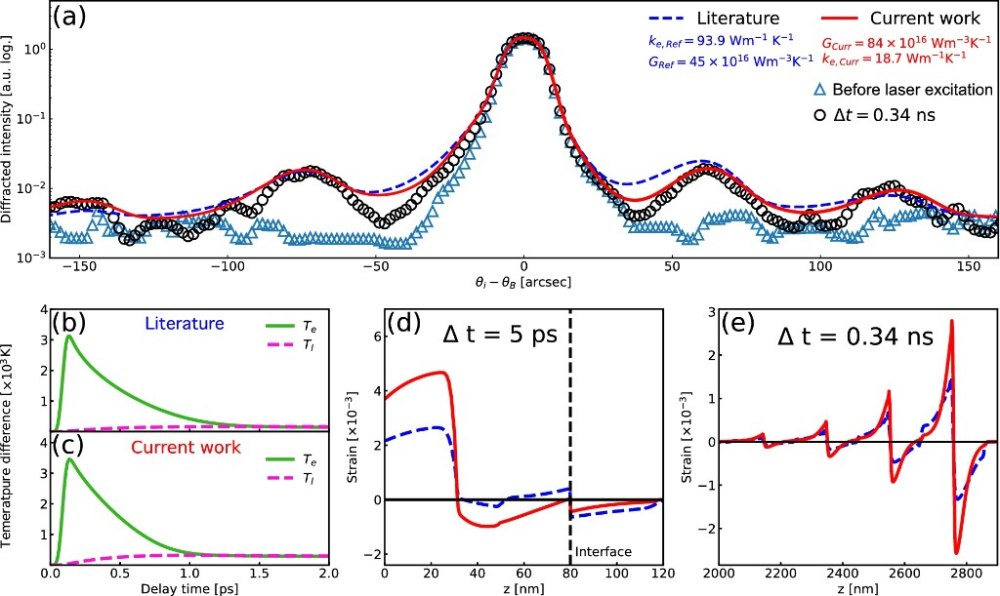
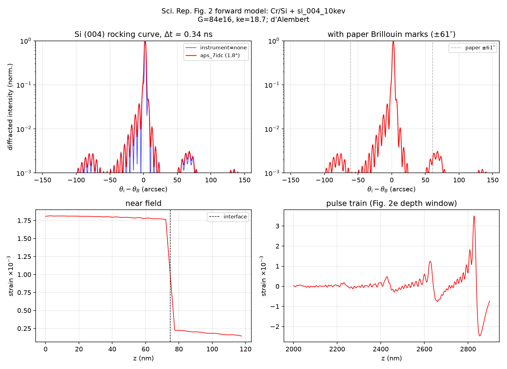
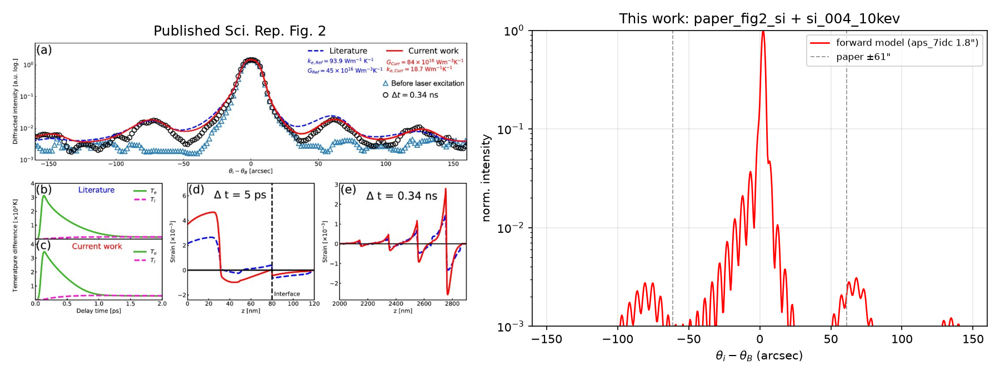

# Sci. Rep. Figure 2 forward model (Cr/Si)

First multi-material paper target after the GaAs Fig. 3 closure
([FIG3_CLOSURE.md](FIG3_CLOSURE.md)).

## Published target



Jo et al., Sci. Rep. **12**, 16606 (2022), Fig. 2 (CC BY 4.0). Panel (a) is the
Si (004) rocking curve at Δt = 0.34 ns; red = paper's fitted \(G=84\times10^{16}\),
\(k_e=18.7\); blue = literature \(G,k_e\). Sidebands near ±61″ are X-ray Brillouin
fringes from the acoustic pulse train.

## What we ran

| Piece | Choice |
|-------|--------|
| Strain preset | `paper_fig2_si` in `strain-wave-simulation` |
| Strain model | `ttm_dalembert_cr_si` |
| Substrate props | Si \(v=8430\) m/s, \(\rho=2329\), \(\beta=2.6\times10^{-6}\), \(C_p=700\), \(k_{\mathrm{bulk}}=148\) |
| Table 1 Si | \(\sigma_{\mathrm{TBC}}=1.1\times10^8\), \(k_s=34\) |
| Film | 80 nm Cr, \(G=84\times10^{16}\), \(k_e=18.7\), \(F=8\) mJ/cm² |
| XRD | `si_004_10kev` (production; GID_sl-checked) |
| Instrument | `aps_7idc` (1.8″) and `none` |

## Results (first pass)





| Check | Result |
|-------|--------|
| Acoustic wavefront | 2866 nm = \(v_{\mathrm{Si}}\,t\) (exact) |
| Pulse-train period (FFT) | ≈200 nm (expected \(v_{\mathrm{Si}}\cdot 2L/v_{\mathrm{Cr}}\) ≈ 204 nm) |
| Strongest +side fringe | ≈68″ (paper marks ≈61″) |
| Fringe amplitude (norm.) | ~3×10⁻³ at the first sideband |

The discrete pulse train and Brillouin sidebands are present with the paper's
fitted \(G,k_e\). The ~7″ fringe-location offset and absolute sideband height
are open for tuning (Si sound speed, instrument kernel, exact delay) in a
later refinement pass — this is a working forward model, not a finished fit.

## How to reproduce

```bash
# strain
cd ../strain-wave-simulation
python -c "from strain_wave import get_preset, run_simulation, save_strain_profile; \
c=get_preset('paper_fig2_si'); r=run_simulation(c); \
save_strain_profile(r.to_profile(), 'results/paper_fig2_si/strain_profile.npz')"

# XRD (example)
cd ../xrd-strain-simulation
python scripts/run.py \
  --strain-file ../strain-wave-simulation/results/paper_fig2_si/strain_profile.npz \
  --crystal si_004_10kev --instrument aps_7idc --no-show
```

Machine-readable metrics: `docs/fig2_forward_summary.json`.

## Status relative to the three-step plan

1. Fig. 3 closure — done ([FIG3_CLOSURE.md](FIG3_CLOSURE.md))
2. Si (004) calculator — done ([CONSTANTS_PROVENANCE_SI.md](CONSTANTS_PROVENANCE_SI.md))
3. Fig. 2 forward model — **done (first pass)**; stop here before a second
   external XRD solver beyond Stepanov GID/X0h
