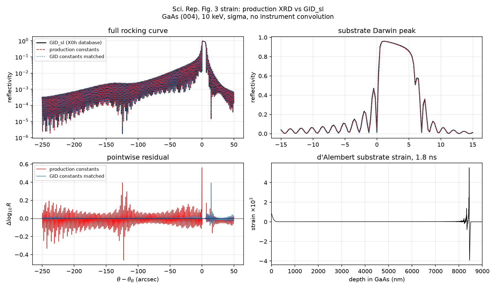

# Sci. Rep. Figure 3 strain: cross-code GID_sl benchmark

This is the realistic-profile continuation of the synthetic strained-layer
[GID_sl smoke test](GID_SL_BENCHMARK.md). It sends the d'Alembert GaAs
substrate strain calculated for the paper's Figure 3 conditions through:

1. the production `gaas_004_10kev` calculator with its audited
   Waasmaier–Kirfel / Henke / Stevenson constants;
2. the same local dynamical solver with Stepanov GID_sl's X0h
   susceptibilities, to isolate numerical-method differences; and
3. Stepanov's independent GID_sl multilayer solver.

No curve has instrument convolution. This is a solver benchmark, not a fit to
the plotted experimental curve.

## Inputs

- Strain repository: `strain-wave-simulation`
- Preset: `paper_fig3_gaas`
- Model: `ttm_dalembert_cr_gaas`
- Time: 1.8 ns
- GaAs depth grid: 26.7 Å
- GID_sl: GaAs (004), 10 keV, σ polarization, symmetric Bragg geometry,
  X0h database, no roughness or disorder factors
- GID_sl profile: one 26.7 Å GaAs layer per nonzero strain cell (3189 layers,
  8.51463 µm), followed by an unstrained semi-infinite GaAs substrate

The portable source profile is cached as
`tests/data/fig3_dalembert_substrate_strain.npz`; the GID_sl curve and server
input echo are `tests/data/gid_sl_fig3_dalembert.dat` and `.inp`.

## Results

| Comparison to GID_sl | log₁₀ RMS | log₁₀ correlation | Peak position | Peak reflectivity |
|---|---:|---:|---:|---:|
| Production constants | 0.0644 | 0.997681 | +1.00″ (same) | 0.95925 vs 0.95980 |
| GID_sl susceptibilities matched | 0.0144 | 0.999879 | +1.00″ (same) | 0.96150 vs 0.95980 |

A log₁₀ RMS of 0.0644 corresponds to a typical multiplicative difference of
about 16%; 0.0144 corresponds to about 3.4%. The largest pointwise log
residuals occur at very sharp destructive-interference minima, where a tiny
shift causes a large relative difference despite very low absolute intensity.



## Interpretation

The realistic strain transfer is validated:

- the substrate Darwin peak position agrees on the same 0.25″ scan sample;
- peak reflectivity differs by only 0.06% with production constants;
- the full curves have 0.9977 log-intensity correlation; and
- matching the scattering susceptibilities reduces the RMS residual by a
  factor of 4.5 and raises correlation to 0.99988.

Therefore, most of the production-vs-GID_sl residual comes from the
**scattering database**, not the depth-dependent strain representation or the
dynamical diffraction algorithm. The simple step tests were less sensitive to
this distinction; the thousands of coherently interfering layers in the
Figure 3 profile amplify small susceptibility differences.

This is not a reason to replace the production constants with GID_sl's X0h
values. The production values have explicit modern provenance, while X0h is a
separate internally consistent reference database. For data analysis, the
constant source should remain explicit and sensitivity should be propagated
where weak interference fringes matter.

## Reproducing

```bash
python scripts/benchmark_fig3_gid_sl.py
```

This writes `docs/fig3_gid_sl_benchmark.json` and the figure above. The
reduced-scan acceptance is enforced by
`test_fig3_strain_matches_gid_sl_when_constants_are_controlled`.

The GID_sl query used the same POST fields documented in
[GID_SL_BENCHMARK.md](GID_SL_BENCHMARK.md), with:

```text
scanmin=-250
scanmax=+50
unis=3
nscan=1201
profile=<one "t=26.7 code=GaAs da/a=<strain>" line per nonzero cell>
```

## Next external checks

The next useful cross-code check is a second implementation independent of
Stepanov's server (for example `xrayutilities`) using the same explicit
susceptibilities. After that, the priority shifts from synthetic/paper-profile
solver validation to measured APS and PLS data, including instrument,
background, mosaicity, and sample-response models.
