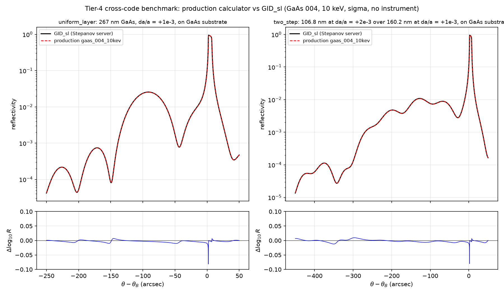

# Tier-4 cross-code benchmark: GID_sl (Stepanov X-ray Server)

Independent, external check of the **production** GaAs (004) calculator
(`gaas_004_10kev`, instrument = `none`) against Sergey Stepanov's GID_sl
dynamical-diffraction solver
([x-server.gmca.aps.anl.gov](https://x-server.gmca.aps.anl.gov/)), which is a
widely used community reference implementation of Takagi–Taupin / recursive
dynamical diffraction for multilayers.

This completes Tier 4 (smoke-test level) of
[EXTERNAL_BENCHMARKS.md](EXTERNAL_BENCHMARKS.md): unlike Tier 3, which only
compared scalar metrics (Darwin FWHM, peak reflectivity) on a perfect crystal,
this compares **entire rocking curves for depth-dependent strain profiles**
point by point.

## Cases

Both cases use GaAs (004), 10 keV (λ = 1.2398418 Å), σ polarization, symmetric
Bragg geometry, zero roughness/DW disorder, semi-infinite GaAs substrate, and
no instrument convolution. Layer thicknesses are exact multiples of the
production grid cell (26.7 Å), so the strain profiles are represented
identically in both codes.

| Case | Strain profile (top to bottom) |
|------|-------------------------------|
| `uniform_layer` | 2670 Å GaAs with Δa/a = +1×10⁻³, then substrate |
| `two_step` | 1068 Å at Δa/a = +2×10⁻³, 1602 Å at Δa/a = +1×10⁻³, then substrate |

## Results (queried 2026-07-18)

| Case | log₁₀ RMS difference | max \|Δlog₁₀R\| | substrate peak |
|------|---------------------|-----------------|----------------|
| `uniform_layer` | 0.0051 | 0.082 | both at +2.25″ (same scan sample) |
| `two_step` | 0.0050 | 0.080 | both at +2.25″ (same scan sample) |

The two codes agree to ~1% in reflectivity over 4–5 decades of dynamic range,
including layer-peak positions, thickness fringes, and interference structure.
The max-difference spike sits on the steep flank of the substrate Darwin peak,
where a sub-sample (< 0.25″) registration difference produces a large local
log difference; it is a sampling artifact, not a physics disagreement.



Top row: GID_sl (black) vs production calculator (red dashed), log scale.
Bottom row: pointwise log₁₀ residual for reflectivities above 10⁻⁶.

## Reproducing

```bash
python scripts/benchmark_gid_sl.py
```

reads the cached reference curves in `tests/data/gid_sl_*.dat`, recomputes the
production curves, writes `docs/gid_sl_benchmark.json` and the figure above,
and exits nonzero if the acceptance thresholds fail. The same thresholds are
enforced in `tests/test_xrd_acceptance.py::test_production_matches_gid_sl_on_strained_layers`.

### Regenerating the GID_sl references

The server's multilayer form (`GID_sl_multilay.htm`) accepts an HTTP POST to
`/cgi/gid_form.pl`. Key fields (the full input echo returned by the server for
each run is cached as `tests/data/gid_sl_*.inp`):

- `xway=1`, `wave=1.2398418` (wavelength in Å for exactly 10 keV)
- `ipol=1` (σ), `code=GaAs`, `df1df2=0` (X0h dispersion database)
- reflection `i1 i2 i3 = 0 0 4`, surface `n1 n2 n3 = 0 0 4`
- `igie=5` (symmetric Bragg case), `sigma=0`, `w0=1`, `wh=1`, `daa=0`
- scan in arcsec (`unis=3`), e.g. `scanmin=-250`, `scanmax=+50`, `nscan=1201`
- `profile` text, e.g. for the uniform layer:

```
t=2670 code=GaAs da/a=0.001
```

and for the two-step case:

```
t=1068 code=GaAs da/a=0.002
t=1602 code=GaAs da/a=0.001
```

The response page links a `.dat` file (two columns: scan angle in arcsec
relative to the substrate Bragg angle, reflectivity) retrievable via
`/cgi/wwwunzip.pl?jobname=<job>&filext=dat`.

## Scope and next steps

- This is the smoke-test tier: synthetic step profiles. The paper Figure 3
  d'Alembert strain comparison is now complete; see
  [FIG3_GID_SL_BENCHMARK.md](FIG3_GID_SL_BENCHMARK.md). A second independent
  implementation (e.g. `xrayutilities`) remains.
- The legacy calculator (`gaas_004_10kev_legacy`) is *not* expected to pass
  this benchmark — it carries the archival F₀=Fₕ approximation and constants;
  see [CONSTANTS_SENSITIVITY.md](CONSTANTS_SENSITIVITY.md).
