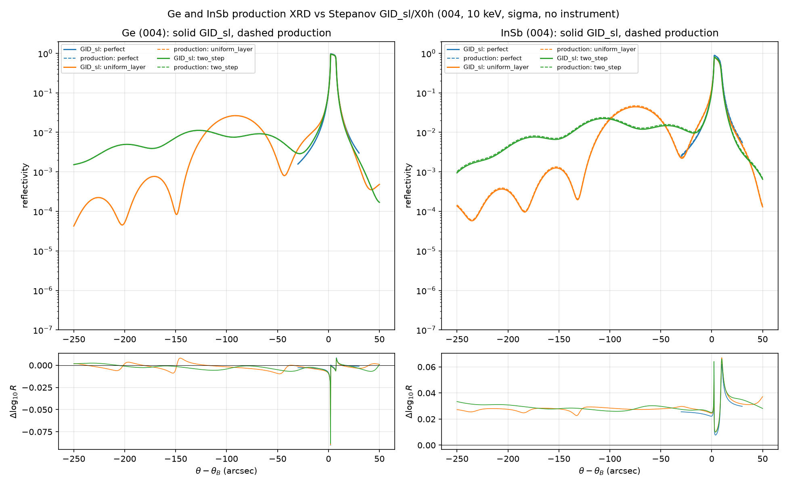

# Ge/InSb cross-code benchmark: Stepanov GID_sl/X0h

The new `ge_004_10kev` and `insb_004_10kev` calculators were compared with
Stepanov's independent GID_sl multilayer solver using its X0h scattering
database.

## Conditions

- symmetric (004), 10 keV, sigma polarization
- perfect substrate, 267 nm uniform `da/a=+1e-3` layer, and a two-step
  106.8 nm `+2e-3` / 160.2 nm `+1e-3` profile
- 26.7 Å local depth cells, matching layer thicknesses exactly
- **no angular instrument convolution**
- **no temporal averaging**

Instrument response is irrelevant to this test because both codes are being
compared at the diffraction-model level.

## Results



| material | case | log10 RMS | correlation | production / GID peak |
|---|---|---:|---:|---:|
| Ge | perfect | 0.0051 | 0.999984 | +2.20 / +2.25 arcsec |
| Ge | uniform | 0.0048 | 0.999991 | +2.25 / +2.25 arcsec |
| Ge | two-step | 0.0045 | 0.999975 | +2.25 / +2.25 arcsec |
| InSb | perfect | 0.0290 | 0.999924 | +2.65 / +2.80 arcsec |
| InSb | uniform | 0.0288 | 0.999990 | +2.50 / +2.75 arcsec |
| InSb | two-step | 0.0299 | 0.999961 | +2.75 / +2.75 arcsec |

Ge closes at the same approximately 1% reflectivity level as the earlier
GaAs benchmark. InSb retains essentially identical curve shape but differs by
roughly 7% in absolute reflectivity, consistent with its greater sensitivity
to absorption and Debye-Waller/scattering-database choices. The independent
xrayutilities matched-susceptibility test reduces the InSb solver residual to
0.0032 log10 RMS, confirming that this is not a propagation-algorithm error.

## Reproduce

```bash
python scripts/benchmark_gid_sl_ge_insb.py
python -m pytest tests/test_ge_insb_004_acceptance.py -q
```

Cached `.dat` reference curves and exact `.inp` server echoes are committed
under `tests/data/gid_sl_{ge,insb}_*`.
