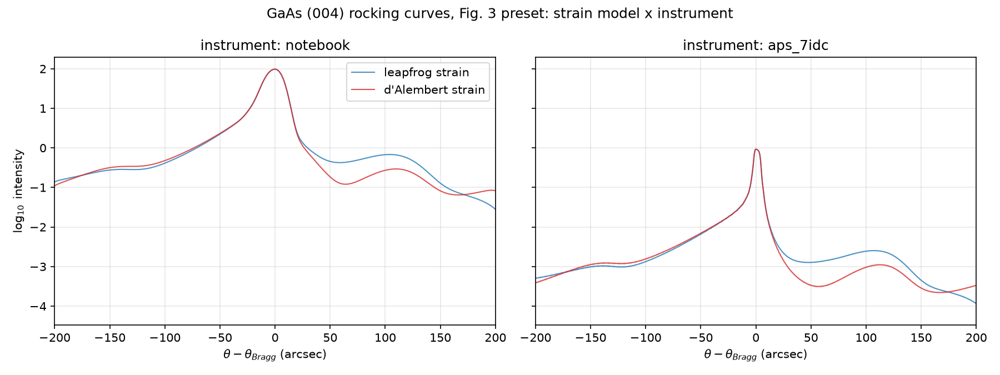

# Instrument (angular resolution) models

The computed dynamical-diffraction rocking curve can be convolved with an
instrument model before output. Select with `--instrument` on the CLI or
`XrdConfig(instrument=...)`.

| instrument | description |
|---|---|
| `notebook` (default) | Multi-Gaussian detector model inherited from the original notebook / thermo-elastic-gaas (tag `paper-v1.0`). Kept as the paper-reproduction default. Note its normalization (`y/len(y)`) shifts the absolute log10 scale. |
| `aps_7idc` | Single area-normalized Gaussian, FWHM `--instrument-fwhm-arcsec` (default 1.8). The Sci. Rep. 2022 experiment quotes 0.5 mdeg ≈ 1.8 arcsec resolution at APS 7ID-C. |
| `none` | Raw curve, no convolution. |

```bash
python scripts/run.py --strain-file strain.npz \
  --instrument aps_7idc --instrument-fwhm-arcsec 1.8 \
  --angle-min 25.975 --angle-max 26.091 --n-points 581 \
  --save-arrays results/curve.npz --no-show
```

## Sampling requirement

The Gaussian convolution acts on the discrete angular grid. For it to be
meaningful, the angular step must resolve the kernel: step < sigma
(sigma = FWHM / 2.355; 1.8 arcsec FWHM -> sigma ≈ 0.76 arcsec, so use a step
of ~0.7 arcsec or finer). At the historical default sampling
(0.1 deg / 100 points = 3.6 arcsec/pt) a 1.8 arcsec kernel is effectively an
identity, and `apply_gaussian_instrument` degrades gracefully to
almost-no-op.

Fine sampling used to be memory-prohibitive: the original whole-array
`xrd_slab_gaas` allocates O(n_layers * n_angles) 4x4 complex propagation
matrices (>1 GB for ~3700 layers x ~600 angles). The calculator now uses
`xrd_slab_gaas_lowmem`, an angle-by-angle wrapper that is numerically
identical (asserted in `tests/test_smoke.py`) with flat memory use.

## Physical note on the 1.8 arcsec resolution

At the Fig. 3 conditions the diffraction features (thickness fringes and
strain shoulder) have ~10–20 arcsec scales, so a 1.8 arcsec instrument only
reduces fringe contrast by a few percent — it does *not* explain all of the
smoothness of the published fit curve. Use `--instrument-fwhm-arcsec` to
explore stronger effective broadening if matching a specific measured curve.

## Validation matrix (with strain-wave-simulation)

`strain-wave-simulation/scripts/validation_matrix.py` runs 2 strain models
x 2 instruments on the paper Fig. 3 preset. Result:



The strain-model choice (leapfrog vs d'Alembert far field) changes the curve
by at most ~0.6–0.8 in log10 intensity, only in the weak shoulder at
+50…+150 arcsec; the Bragg peak is unaffected.
