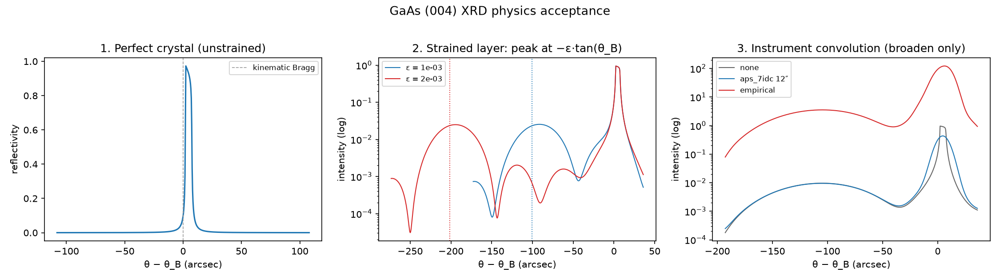

# XRD-calculator validation

Internal, physics-based validation of the GaAs (004) dynamical diffraction
calculator, to be green **before** any external benchmarking (Sci. Rep. Fig. 3
or APS/PLS data). This mirrors the strain repo's `docs/VALIDATION.md`.

Run:

```bash
python scripts/validate_xrd_physics.py           # report + figure, nonzero exit on failure
python -m pytest tests/test_xrd_acceptance.py -q
```

Outputs: `docs/physics_acceptance.json` and `docs/images/xrd_acceptance.png`.
The checks assert on analytic/known quantities, not frozen numerical snapshots
(except the deliberate regression golden), so they document the physics and
catch real regressions.

## 1. Unstrained perfect-crystal rocking curve

An essentially unstrained thick GaAs slab must give the textbook Darwin curve:

- **Peak position** at the refractively shifted Bragg angle:
  kinematic `θ_B = 26.0165°`, numerical peak ≈ 26.0171° (+2.3 arcsec).
- **Peak reflectivity** 0.973 for a thick perfect crystal.
- **Absorbing-curve FWHM** ≈ 5.73 arcsec.

The last two are now strict external acceptances against Stepanov X0h/GID_sl:
0.97283 and 5.73686 arcsec, respectively (agreement ~0.1% at fine sampling).

## 2. Known strain → Bragg shift

A uniformly strained surface layer on the substrate produces a second peak
displaced by the kinematic law `Δθ = -ε·tan(θ_B)` (tensile out-of-plane strain
→ larger d → lower angle):

- ε = 2×10⁻³ gives a layer peak at −196.9 arcsec vs predicted −201.4 arcsec
  (2.2% off, correct sign). Tolerance: 10%.
- the shift **scales linearly with ε**: shift(2e-3)/shift(1e-3) = 2.10
  (expect 2).

This is the core diffraction-physics check: peak separation ↔ strain magnitude.

## 3. Instrument-convolution sanity

Convolution must only *broaden*, never move the peak or invent structure:

- **Broadening** increases FWHM: none 5.73 → aps_7idc(12″) 13.45 → empirical
  18.09 arcsec.
- **No new structure**: the number of local maxima does not increase under
  either kernel.
- **Intensity conservation**: the symmetric normalized `aps_7idc` Gaussian
  conserves integrated intensity (ratio 0.9999). *Note:* the `empirical`
  multi-Gaussian kernel does **not** conserve area (a known normalization
  artifact of the inherited convolution — it rescales the curve; see
  `docs/INSTRUMENTS.md`), so area conservation is only asserted for `aps_7idc`.
- **Peak stability**: `aps_7idc` moves the peak centroid by −0.12 arcsec
  (symmetric kernel). The `empirical` kernel has deliberate offset centers and
  may shift slightly.



## 4. Frozen-notebook regression

`tests/test_xrd_acceptance.py::test_frozen_notebook_regression` requires the
legacy `xrd_slab_gaas` (and the low-memory path) to reproduce a golden rocking
curve **bit-for-bit** (atol 1e-12; observed max abs diff 0.0). The golden data
`tests/data/gaas004_golden.npz` was generated from the archival
thermo-elastic-gaas calculator (tag `paper-v1.0`) on a fixed strain profile,
so the split/refactor is proven to preserve the published numerics without
needing the other repo at test time.

## When to re-run

- After any change to `crystals/gaas_004_dynamical.py`, the detector models, or
  the pipeline.
- Before adding a new substrate/reflection: these checks define the GaAs
  baseline a new calculator should reproduce in structure.
- The checked-in `docs/physics_acceptance.json` is the run-of-record; diff it
  after re-running.

## External benchmark status

The production `gaas_004_10kev` calculator now uses audited 300 K constants
and distinct forward/diffracting factors \(F_0,F_h\). Tests require its
\(\chi_0,\chi_h\), FWHM, and peak reflectivity to match Stepanov X0h/GID_sl.
The notebook implementation remains selectable as
`gaas_004_10kev_legacy`. See
[`CONSTANTS_SENSITIVITY.md`](CONSTANTS_SENSITIVITY.md).

Beyond scalar metrics, the production calculator also reproduces full GID_sl
rocking curves on synthetic strained-layer profiles (uniform layer and
two-step) to ~1% RMS over 4–5 decades of dynamic range, enforced by
`test_production_matches_gid_sl_on_strained_layers`. See
[`GID_SL_BENCHMARK.md`](GID_SL_BENCHMARK.md).

The d'Alembert Figure 3 strain profile is also checked against GID_sl. With
the normal production constants the full log curves correlate at 0.9977;
using GID_sl's own susceptibilities in the same local solver raises this to
0.99988 and reduces log-RMS residual from 0.0644 to 0.0144. This separates
scattering-database sensitivity from solver agreement and is enforced by
`test_fig3_strain_matches_gid_sl_when_constants_are_controlled`. See
[`FIG3_GID_SL_BENCHMARK.md`](FIG3_GID_SL_BENCHMARK.md).
