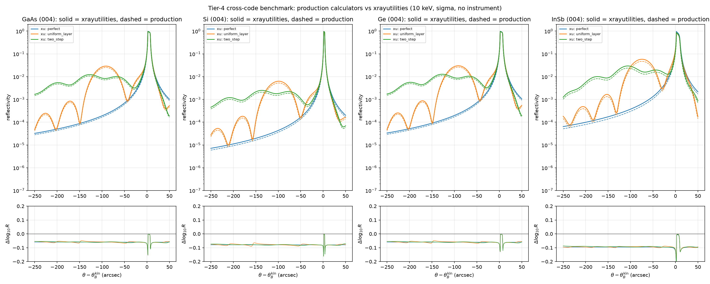

# Tier-4 cross-code benchmark: xrayutilities (second external code)

Second *independent* dynamical-diffraction implementation, after Stepanov
GID_sl / X0h ([GID_SL_BENCHMARK.md](GID_SL_BENCHMARK.md),
[FIG3_GID_SL_BENCHMARK.md](FIG3_GID_SL_BENCHMARK.md)). Two independent codes
already agreeing is good; a *third* independent code closing the loop is much
stronger evidence, because the three share neither implementation nor
scattering database.

[xrayutilities](https://xrayutilities.sourceforge.io/) `simpack.DynamicalModel`
is a generalized 2-beam (4-tiepoint) dynamical solver with its own materials /
scattering database, developed and maintained independently of this package
and of the X-ray Server.

## What is compared

All four APS campaign substrates (GaAs, Si, Ge, and InSb 004), 10 keV, sigma
polarization, symmetric Bragg, on three synthetic strain profiles (surface
layer first):

| case | profile |
|------|---------|
| `perfect` | bare substrate |
| `uniform_layer` | 267 nm at Δa/a = +1×10⁻³ on substrate |
| `two_step` | 106.8 nm at +2×10⁻³ over 160.2 nm at +1×10⁻³ on substrate |

**No instrument convolution** is applied on either side
(`resolution_width=0` in xrayutilities, `instrument=none` here): a cross-code
check is a test of diffraction *physics*, not of the beamline angular/temporal
response ([INSTRUMENTS.md](INSTRUMENTS.md)). Each code is scanned about its own
kinematic Bragg angle so curve *shape* is compared without a trivial lattice
offset.

Three curves per case:

- **`xu`** — xrayutilities DynamicalModel;
- **`production`** — our audited calculators (Waasmaier & Kirfel f₀,
  Henke f′/f″, material-specific 300 K Debye-Waller factors);
- **`matched`** — our *solver* fed xrayutilities' own χ₀/χ_h.

`production` vs `xu` measures total agreement (numerics + database);
`matched` vs `xu` isolates the numerical engine from the database choice.

## Results (xrayutilities 1.7.12, expanded four-material run 2026-07-19)



Solid = xrayutilities, dashed = production; lower panels are the pointwise
log₁₀ residual.

| material | case | production corr | production log RMS | matched corr | matched log RMS |
|----------|------|----------------|--------------------|--------------|------------------|
| GaAs | perfect | 0.99996 | 0.060 | 1.000000 | 0.0000 |
| GaAs | uniform_layer | 0.99995 | 0.060 | 0.999992 | 0.0040 |
| GaAs | two_step | 0.99984 | 0.060 | 0.999987 | 0.0027 |
| Si | perfect | 0.99997 | 0.080 | 1.000000 | 0.0000 |
| Si | uniform_layer | 0.99995 | 0.079 | 0.999989 | 0.0045 |
| Si | two_step | 0.99987 | 0.079 | 0.999988 | 0.0028 |
| Ge | perfect | 0.99996 | 0.061 | 1.000000 | 0.0000 |
| Ge | uniform_layer | 0.99995 | 0.060 | 0.999992 | 0.0040 |
| Ge | two_step | 0.99985 | 0.060 | 0.999987 | 0.0027 |
| InSb | perfect | 0.99986 | 0.097 | 1.000000 | 0.0000 |
| InSb | uniform_layer | 0.99987 | 0.095 | 0.999995 | 0.0032 |
| InSb | two_step | 0.99949 | 0.094 | 0.999990 | 0.0032 |

Two clean conclusions:

1. **Our numerical dynamical-diffraction engine is equivalent to
   xrayutilities.** With matched susceptibilities the curves agree to
   log₁₀ RMS ≤ 0.005 over 4–5 decades (machine-zero for the perfect crystal,
   ~0.003–0.005 for strained layers where xrayutilities re-evaluates f₀(Q_h)
   per layer while we hold it fixed — a negligible effect at Δa/a ≤ 2×10⁻³).
2. **The remaining production offset is purely the scattering database.** The
   flat ~0.06 (GaAs/Ge), ~0.08 (Si), or ~0.095 (InSb) log residual is a
   near-constant reflectivity scale, not a shape error. It comes from the
   Debye-Waller factor: our production model includes 300 K DW (which is what
   reconciled the perfect-crystal FWHM and peak R with X0h/GID_sl in
   [CONSTANTS_SENSITIVITY.md](CONSTANTS_SENSITIVITY.md)), whereas
   xrayutilities' default χ_h omits it (its χ_h imaginary part equals χ₀'s, and
   |χ_h| is correspondingly larger). See the susceptibility table in
   `docs/xrayutilities_benchmark.json`.

The sharp residual spike at the substrate peak is a sub-sample registration
artifact on the steep Darwin flank (same as in the GID_sl benchmark), not a
physics disagreement.

## Reproducing

```bash
python scripts/benchmark_xrayutilities.py          # figure + JSON, exits nonzero on fail
python -m pytest tests/test_xrayutilities_benchmark.py -q
```

The test auto-skips when xrayutilities is not installed.

### Installing xrayutilities

There is no prebuilt wheel for recent macOS/Python; it builds from source and
needs OpenMP. On Apple Silicon:

```bash
brew install libomp
export LDFLAGS="-L$(brew --prefix libomp)/lib"
export CPPFLAGS="-I$(brew --prefix libomp)/include"
export CFLAGS="-I$(brew --prefix libomp)/include"
pip install xrayutilities
```

## Scope and next steps

- Second independent code, all four APS substrates: **done**. Three codes
  (this package, GID_sl, xrayutilities) now agree on perfect and synthetic
  strained layers.
- Natural extension: run the Fig. 3 d'Alembert strain field through
  xrayutilities as a third-code check of
  [FIG3_GID_SL_BENCHMARK.md](FIG3_GID_SL_BENCHMARK.md); and add a matched-χ
  Fig. 2 (Cr/Si) cross-check.
- Beyond synthetic/library strain: material-specific Cr/substrate profiles,
  then APS / PLS experimental data.
